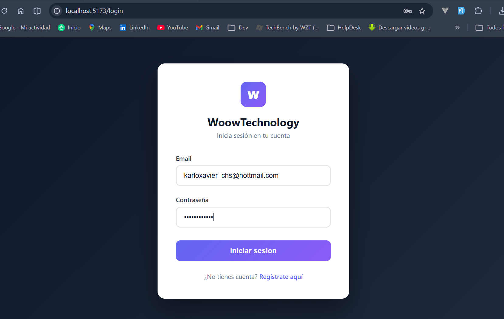
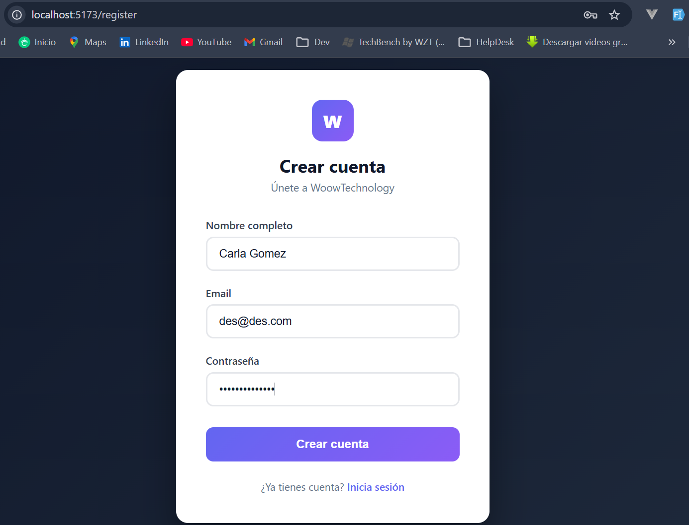
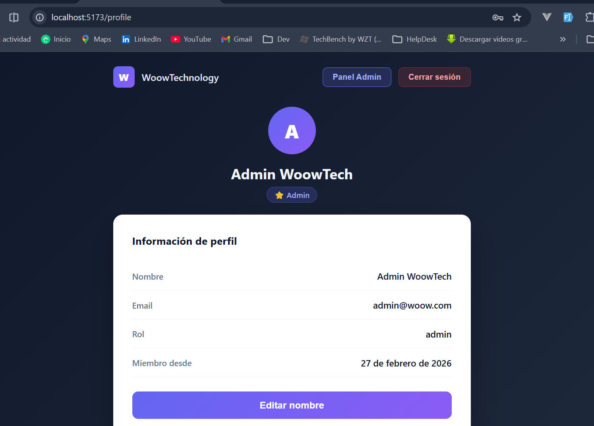
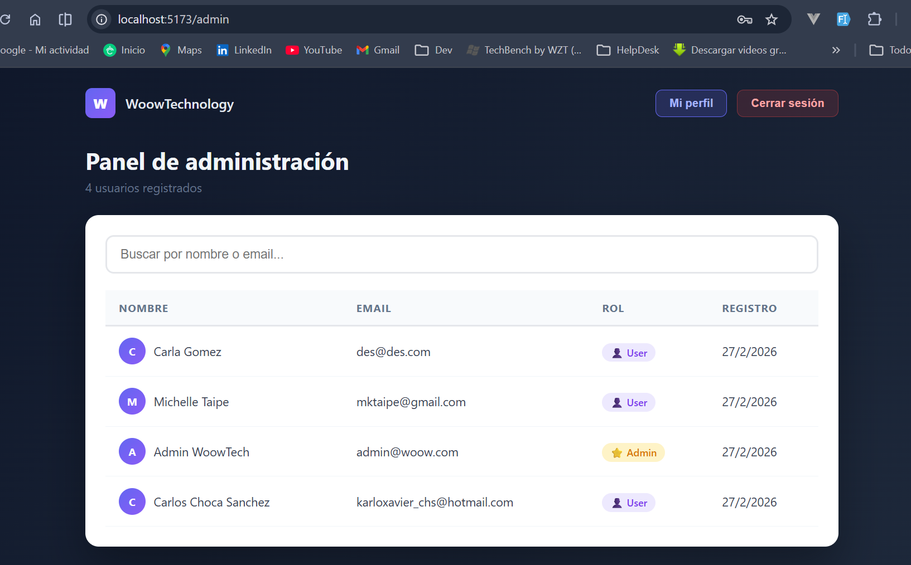
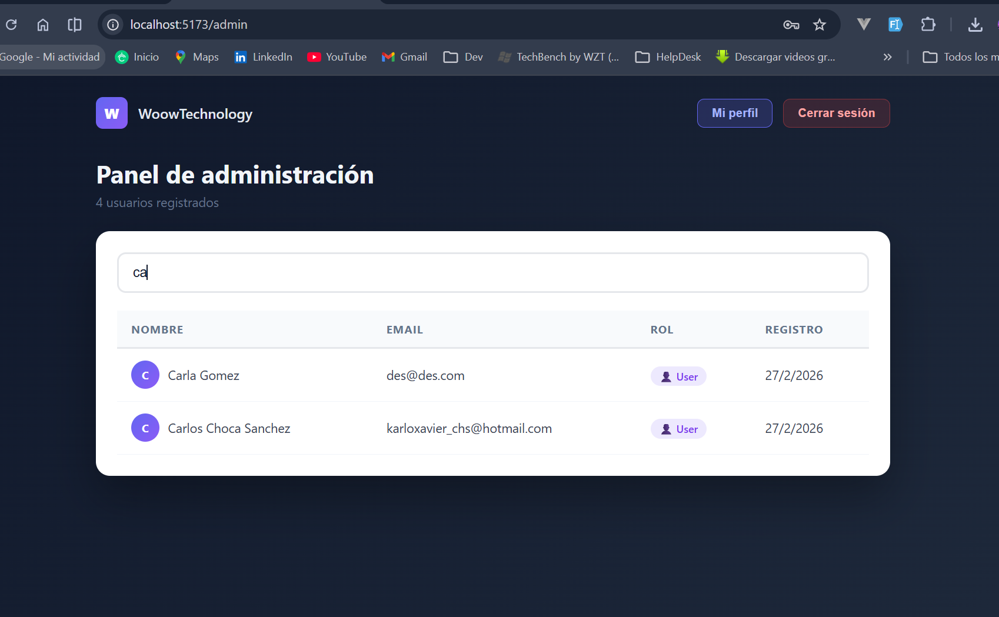
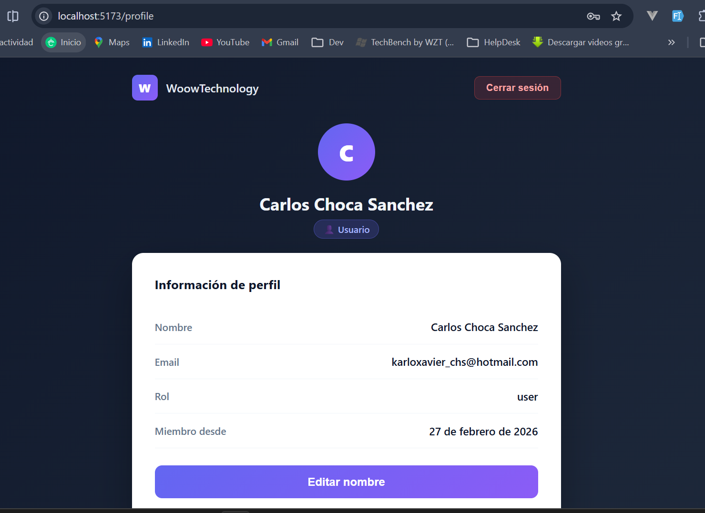

# WoowTechnology — API REST + Frontend

Sistema de gestión de usuarios con autenticación JWT.
Stack: **Node.js · Express · TypeScript · PostgreSQL · React · Vite**

---

## Descripción del proyecto

Aplicación fullstack que permite registrar usuarios, autenticarse mediante JWT y gestionar perfiles. Incluye roles de `user` y `admin`, donde el administrador puede ver el listado completo de usuarios registrados.

---

## Tecnologías Utilizadas

### Backend

- Nodejs Express
- Pg
- Bcryptjs
- Jsonwebtoken
- Cors
- Dotenv
- Express-validator

### Frontend

- React
- Vite
- Axios
- React Router DOM

## Prerrequisitos

- [Node.js 18+](https://nodejs.org/)
- [Docker Desktop](https://www.docker.com/products/docker-desktop/) — para levantar PostgreSQL

---

## Cómo crear la base de datos

La base de datos corre en Docker. Al ejecutar `docker-compose up -d` se crea automáticamente con la tabla `users` y los datos de prueba cargados. No necesitas instalar PostgreSQL manualmente.

```bash
cd backend
docker-compose up -d
```

Esto hace automáticamente:

1. Descarga la imagen de PostgreSQL 16-alpine
2. Crea la base de datos `woow_db`
3. Ejecuta `database/schema.sql` — crea la tabla `users`
4. Ejecuta `database/seed.sql` — carga los usuarios de prueba

Verificar que esté corriendo:

```bash
docker ps
# Debes ver: woow_postgres   Up
```

Si necesitas conectarte directamente a la base de datos:

```bash
docker exec -it woow_postgres psql -U postgres -d woow_db
```

---

## Instalación paso a paso

### Backend

```bash
# 1. Entrar a la carpeta
cd backend

# 2. Copiar variables de entorno
cp .env.example .env

# 3. Levantar PostgreSQL con Docker
docker-compose up -d

# 4. Instalar dependencias
npm install

# 5. Iniciar el servidor
npm run dev
```

### Frontend

```bash
# 1. Entrar a la carpeta
cd frontend

# 2. Instalar dependencias
npm install

# 3. Iniciar el servidor de desarrollo
npm run dev
```

---

## Cómo ejecutar el proyecto

Debes tener corriendo **los tres** al mismo tiempo, en este orden:

```bash
# Terminal 1 — Base de datos
cd backend
docker-compose up -d

# Terminal 2 — Backend
cd backend
npm run dev

# Terminal 3 — Frontend
cd frontend
npm run dev
```

| Servicio     | URL                          |
| ------------ | ---------------------------- |
| Backend API  | http://localhost:3000        |
| Frontend     | http://localhost:5173        |
| Health check | http://localhost:3000/health |

---

## Endpoints disponibles

### Auth

**POST /api/auth/register** — Registrar usuario

```bash
curl -X POST http://localhost:3000/api/auth/register \
  -H "Content-Type: application/json" \
  -d '{"name": "Carlos Choca 2", "email": "harlericho@gmail.com", "password": "carlos12345678"}'

# Respuesta 201:
# { "message": "Usuario registrado exitosamente" }
```

**POST /api/auth/login** — Iniciar sesión

```bash
curl -X POST http://localhost:3000/api/auth/login \
  -H "Content-Type: application/json" \
  -d '{"email": "harlericho@gmail.com", "password": "carlos12345678"}'

# Respuesta 200:
# { "token": "eyJhbGci...", "user": { "id": "...", "name": "Juan Pérez", "email": "juan@example.com", "role": "user" } }
```

### Usuarios (requieren token)

**GET /api/users/me** — Ver mi perfil

```bash
curl http://localhost:3000/api/users/me \
  -H "Authorization: Bearer <token>"

# Respuesta 200:
# { "id": "...", "name": "Juan Pérez", "email": "juan@example.com", "role": "user" }
```

**PUT /api/users/me** — Actualizar mi nombre

```bash
curl -X PUT http://localhost:3000/api/users/me \
  -H "Authorization: Bearer <token>" \
  -H "Content-Type: application/json" \
  -d '{"name": "Carlos Javier Choca 2"}'

# Respuesta 200:
# { "message": "Perfil actualizado", "user": { ... } }
```

**GET /api/users** — Listar todos los usuarios (solo admin)

```bash
curl http://localhost:3000/api/users \
  -H "Authorization: Bearer <token_admin>"

# Respuesta 200:
# { "users": [ ... ] }
```

---

## Credenciales de prueba

| Rol     | Email                       | Password     |
| ------- | --------------------------- | ------------ |
| Admin   | admin@woow.com              | admin123456  |
| Usuario | karloxavier_chs@hotmail.com | user12345678 |

El admin puede acceder al panel de administración desde el botón **"Panel Admin"** que aparece en su perfil después de iniciar sesión.

### Desde el frontend (http://localhost:5173)

**Usuario normal:**

1. Ir a `http://localhost:5173/login`
2. Ingresar email `karloxavier_chs@hotmail.com ` y password `user12345678`
3. Verás tu perfil con opción de editar el nombre y cerrar sesión

**Usuario admin:**

1. Ir a `http://localhost:5173/login`
2. Ingresar email `admin@woow.com` y password `admin123456`
3. Verás tu perfil igual que el usuario normal
4. Adicionalmente aparece el botón **"Panel Admin"** que da acceso al listado de todos los usuarios registrados

---

## Muestra de la interfaz de usaurio








## Scripts disponibles

### Backend

| Comando         | Descripción                        |
| --------------- | ---------------------------------- |
| `npm run dev`   | Desarrollo con hot-reload          |
| `npm run build` | Compilar TypeScript                |
| `npm start`     | Producción (requiere build previo) |

### Frontend

| Comando           | Descripción         |
| ----------------- | ------------------- |
| `npm run dev`     | Desarrollo con Vite |
| `npm run build`   | Build de producción |
| `npm run preview` | Preview del build   |

### Docker

| Comando                     | Descripción            |
| --------------------------- | ---------------------- |
| `docker-compose up -d`      | Levantar PostgreSQL    |
| `docker-compose down`       | Detener PostgreSQL     |
| `docker-compose down -v`    | Detener y borrar datos |
| `docker logs woow_postgres` | Ver logs de la DB      |

## Autor

**Elaborado por:** Carlos Choca Sanchez  
**Sitio web:** [https://harlericho.com/](https://harlericho.com/)
